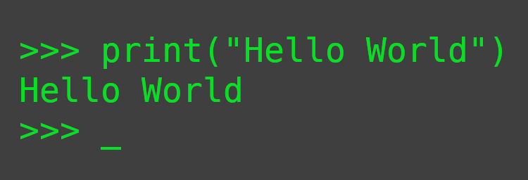

# Hi there, I'm Adi Jaya Wibawa! 👋

### 👨‍💻 About Me
I am an Informatics Engineering student at ITB Asia Malang with a deep passion for technology, infrastructure, and software development. I thrive on solving complex problems, whether it's optimizing code, securing a server, or analyzing market trends. 

When I'm not coding, you can find me exploring the world of cryptocurrency, creating tech & gaming content, or managing my startup business.

- 🎓 **Currently studying:** Informatics Engineering at ITB Asia Malang
- 💡 **Interests:** Network Engineering, Cybersecurity, Fullstack Development, & LLM Integration
- 🚀 **Currently working on:** A smart health-recommendation app utilizing Flutter and Large Language Models (LLM) for PKM (Student Creativity Program).
- 🤝 **Open for collaboration:** Innovative app development, open-source IT infrastructure tools, or Web3/Crypto projects.
- 📫 **How to reach me:** [Insert your Email or LinkedIn here]

---

### 🛠️ Tech Stack & Skills

#### **Languages**

#### **Frameworks & Tools**

#### **Core Competencies**
*   **Infrastructure & Security:** Server Administration, Network Routing & Subnetting, DHCP Config, Privilege Escalation.
*   **Software Engineering:** Cross-platform Mobile App Dev (Flutter), Web Development, Algorithmic Logic.
*   **Emerging Tech:** LLM Prompting & Integration, Crypto Trading Strategies (Spot, Futures, Scalping).

---

### 📂 Featured Projects

*   **Smart Calorie Deficit App (PKM Project)** 
    A prototype application built with **Flutter** that leverages **Large Language Models (LLM)** to provide intelligent and personalized calorie deficit recommendations. 
*   **ATM Machine Simulator**
    A Python-based simulation utilizing **JSON** to understand and replicate the core algorithmic logic and data structuring of automated teller machines.

---

### 📊 GitHub Stats

<!--
**AdiJayaW/AdiJayaW** is a ✨ _special_ ✨ repository because its `README.md` (this file) appears on your GitHub profile.

Here are some ideas to get you started:

- 🔭 I’m currently working on ...
- 🌱 I’m currently learning ...
- 👯 I’m looking to collaborate on ...
- 🤔 I’m looking for help with ...
- 💬 Ask me about ...
- 📫 How to reach me: ...
- 😄 Pronouns: ...
- ⚡ Fun fact: ...
-->
